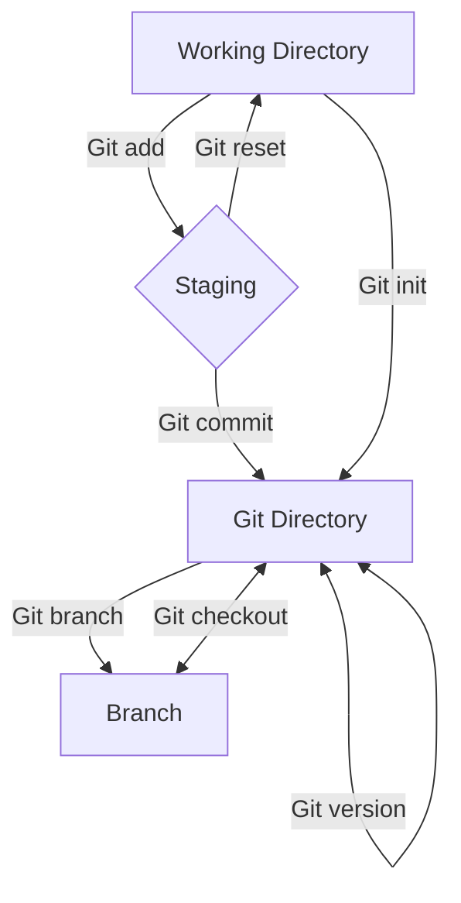

# WIKI

## **Tools needed**

## Code Editor

[![Visual-Studio-Code][vscode]][vscode-url]

- Used to write and build applications

## Web Browser

[![Microsoft-Edge][edge]][edge-url]

- Default Browser to use for research and testing of webb applications. This browser comes with Windows OS which is the OS I´m using.

## Source Control Manager

[![Git][git]][git-url]

- Handles files and documentation. Makes it easy to have control over the files you are editing right now and makes it easy to share code into repository in Github. Installing Git will come with a few dependencies such as node.js, nmp and chocolatey

## Javascript runtime environment

[![Node.js][node.js]][node-url]

- With node.js you can with the help of npm install various package to your project without searching the web yourself. You can also open a file on the server and return the content to the client.

---

## **Basic Git Commands**

## Git version

[Official documentation](https://git-scm.com/docs/git-version)

### Use to check what version of git you have downloaded

```
git version

Output:
git version 2.39.0.windows.1
```

## Git config

[Official documentation](https://git-scm.com/docs/git-config)

### Use config to tell git who you are so it can see who is changing, staging files and who is doing the commits.

```
git config --global user.email "you@example.com"
```

```
git config --global user.name "Your Name"
```

## Git init

[Official documentation](https://git-scm.com/docs/git-init)

### Use to start a git repository in your project. Creates a hidden .git file that tracks your other files

```
git init

Output:
Initialized empty Git repository in C:/Wiki/.git/
```

## Git status

[Official documentation](https://git-scm.com/docs/git-status)

### Use to check the status of the files in the folder you are in. For example shows if any files have been changed and show if the file changes are staged or unstaged.

```
git status

Output:
On branch main
Your branch is up to date with 'origin/main'.

Changes not staged for commit:
  (use "git add <file>..." to update what will be committed)
  (use "git restore <file>..." to discard changes in working directory)
        modified:   intro.md

no changes added to commit (use "git add" and/or "git commit -a")
```

## Git add

[Official documentation](https://git-scm.com/docs/git-add)

### Use git add to stage changed fil and make them ready for commits. You tell git to track the files you add

```
git add <filename>
```

```
git add -A (to add all the changed files)

Output:
```

## Git commit

[Official documentation](https://git-scm.com/docs/git-commit)

### Use git commit to save all staged files and if you add -m you can add a comment to describe what the changes were.

```
git commit -m "..."
```

## Git log

[Official documentation](https://git-scm.com/docs/git-log)

### Use see all the commits you have done and all the details to that commit such as timestamp of the commit, date and who made the commit.

```
git log
```

## Git checkout

[Official documentation](https://git-scm.com/docs/git-checkout)

### Use to navigate between branches created by git branch. With commits you can through git checkout commit old versions of the file, as a way to revet back to an old version.

```
git checkout
```

## Git branch

[Official documentation](https://git-scm.com/docs/git-branch)

### Used to create, view and delete branches.

```
git branch <name of branch>
```

## Git diff

[Official documentation](https://git-scm.com/docs/git-diff)

### Use if you want to see the changes you have made compared to your last commit but it will only display changes that are still unstaged. If you have staged all changes git diff won´t display anything.

```
git diff
```

---

## **Conceptual Drawing**



---

## **FAQ**

## What is Github and what is it used for?

Github is a free cloud-based storing of Git repository. Makes it easy for anyone that uses Git to store code in a place that you can access from anywhere. It also makes it easy to collaborate with others by sharing you repository and people easily clone your repository to their local computer. Github makes it easy to take a look at other peoples projects for inspiration or just out of curiosity.

---

## How do you work as multiple people in the same project?

Through Github multiple people can access and clone down your repository to their local computer and start coding themselves. They can later push their changes to the Github repository for you to pull. You need to be careful to not get a merge conflict which essentially means that you both have been working in the same place in a file and trying to push both changes.

Make sure that you push your files to the right branch in Github. In bigger projects you work on multiple branches and you need to make sure that you push your files and changes to the right branch.

If you make a mistake and want to stop the merge you can use "git merge --abort" and want to resolve the problem before the merge happens.

You can also use "git checkout" to take away a specific part of the merge, for example your changes in the merge conflict.

---

## How do you solve merge conflicts?

Through Vscode, which I use, merge conflict a relatively easy to fix. It puts in the merge conflict together in a single file and then you delete and save what you want to keep just as you do normally.

[edge]: https://img.shields.io/badge/Microsoft_Edge-0078D7?style=for-the-badge&logo=Microsoft-edge&logoColor=white
[edge-url]: https://www.microsoft.com/edge
[vscode]: https://img.shields.io/badge/Visual_Studio_Code-0078D4?style=for-the-badge&logo=visual%20studio%20code&logoColor=white
[vscode-url]: https://code.visualstudio.com/
[git]: https://img.shields.io/badge/GIT-E44C30?style=for-the-badge&logo=git&logoColor=white
[git-url]: https://git-scm.com/
[node.js]: https://img.shields.io/badge/Node.js-43853D?style=for-the-badge&logo=node.js&logoColor=white
[node-url]: https://nodejs.org/
